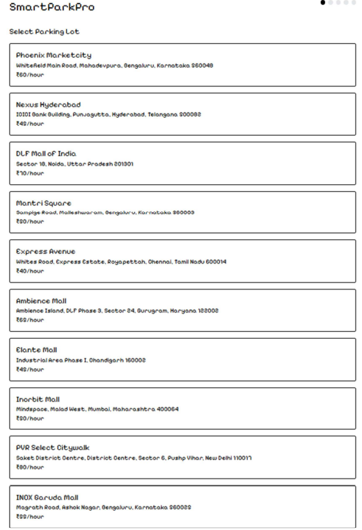
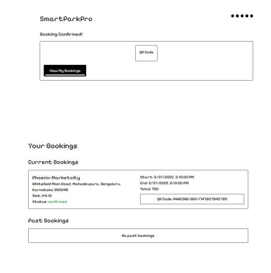
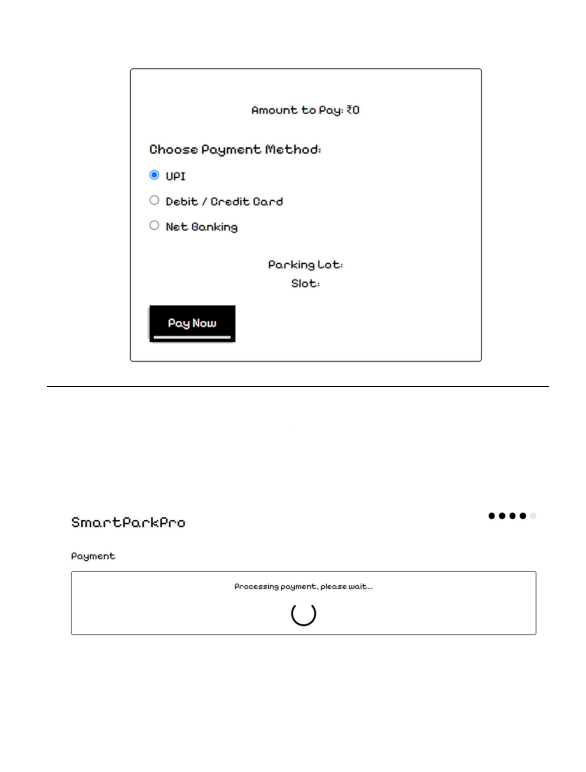

# SmartParkPro 🚗

SmartParkPro is a smart parking booking system that allows users to find parking lots, reserve slots, and make payments online.

## Features

* Find nearby parking lots
* Real-time slot availability
* Book parking slots with selected time
* QR-based booking confirmation
* Secure authentication system
* Admin dashboard to manage parking lots

## Tech Stack

Frontend: React / Next.js
Backend: Node.js APIs
Database: PostgreSQL

## System Architecture

* Frontend UI for booking and payments
* Backend APIs to handle bookings and slot management
* PostgreSQL database to store parking lots, slots, and bookings

## Key Modules

### User Features

* Sign up and login
* View parking lots
* Book slots
* Payment system
* View booking history

### Admin Features

* Manage parking lots
* Monitor bookings
* View system statistics

## Database

The database schema includes:

* parking_lots
* parking_slots
* bookings
* users

## Screenshots

## Future Improvements

* Live map integration
* AI-based parking prediction
* Mobile app version

## Author

Varun Shreyas.B